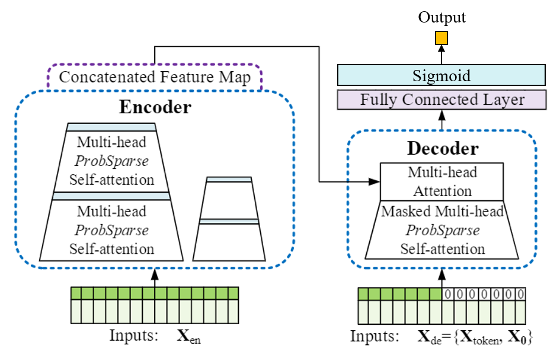
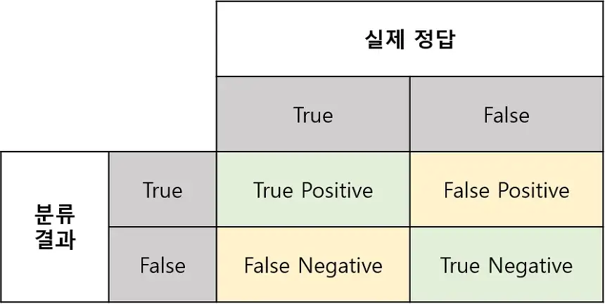
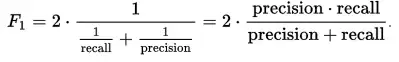

 SPDX-FileCopyrightText: © 2023 ISLAB-AI <islab.aiteam@gmail.com>
 < SPDX-License-Identifier: MIT


# Informer 기반의 사육관리 질병 예측 모델
:triangular_flag_on_post: Original Informer GitHub 주소: https://github.com/zhouhaoyi/Informer2020.git

Informer 기반의 사육관리 질병 예측 모델은 양식장 수질환경, 사육관리, 질병진단 기록을 활용하여 시간의 흐름에 따라 수조별 질병 발생 가능성을 예측하는 모델이다. 입력으로 들어가는 features를 보고, 다음날 질병의 유무를 판단하기 때문에 이중 분류 task라고 볼 수 있다. 따라서 기본 Informer 모델에서 decoder의 출력 다음의 fully connected layer에 sigmoid 모듈을 추가하여 질병의 유무를 판단할 수 있도록 모델을 새로 설계했다. 또한, 이중 분류이기 때문에 loss를 BCE(Binary Cross Entropy)로 바꾸고 BinaryF1Score를 사용하여 모델의 성능을 측정하였다.


<p align="center">

<br><br>
<b>Figure 1.</b> The architecture of model.
</p>


## ProbSparse Attention 
Sparsity한 self-attention은 active queries가 "head score"에 있고 lazy queries 즉, 영향력이 낮은 queries가 "tail area"에 있는 꼬리가 긴 분포(long tail distribution)를 가진다. 영향력이 낮은 lazy queries가 아닌 active queries를 선택하도록 ProbSparse Attention을 설계하였다. 확률 분포로 중요한 queires를 구분해내어 상위 u개(Top-u)의 queries를 사용한다. ProbSparse Attention은 sparsity 측정 지표를 바탕으로 유의미한 query를 Top-u개만 선택하여 attention을 계산하는 방법 


## Input
- Encoder의 Input: `[index, seq_len]` 
- Decoder의 Input: `[seq_len - label_len : seq_len + pred_len]` 
- Decoder는 encoder의 정보를 label_len 길이만큼 참고하여 pred_len을 추론

## Output
- Output: `c_out`크기의 출력이 나옴(`c_out=1`) 
- 최종적으로 Sigmoid를 거치기 때문에 1 또는 0이 output으로 출력 

## task
:triangular_flag_on_post: Binary Classification task 
장기 시계열 예측을 수행하는 `Informer` 모델의 출력단에 `Sigmoid` 모듈을 추가하여, 특정 날 질병의 발생 유무를 판단하는 Binary Classification task. 

## Training
Binary Classification task이므로 `Loss`는 `BCELoss`를 사용한다. 학습 `epoch`은 `10`으로 돌리는데, epoch을 더 크게 하더라도 `EarlyStopping`으로 10에서 학습을 종료한다. 조금 더 섬세한 학습을 위해 `learning_rate`를 `1e-5`로 변경하여 최종 학습하였다. `Batch_size`는 `64`로, 이렇게 `Hyper-parameter`를 구성했을 때 가장 좋은 결과가 나왔다.  

- BCELoss: `Binary Cross Entropy Loss`
- Adam Optimizer 
- epochs : `10`
- learning_rate: `1e-5`
- batch_size : `64`

## Evaluation metric
모델 성능평가 척도로는 `F1-Score`를 사용한다. 데이터 질병의 유무가 불균형한 데이터이기 때문에 `F1-Score`로 측정을 하는 것이 좋다. Binary Classification이므로 `pytorch`의 `BinaryF1Score()`를 사용하여 모델을 평가하였다. 


<p align="center">

<br><br>
<b>Figure 2.</b> Confusion matrix.
</p>
&nbsp
&nbsp
<p align="center">

<br><br>
<b>Figure 3.</b> F1-Score.
</p>


## Requirements

- Python 3.9.12
- pandas == 1.5.2
- numpy == 1.22.3
- torch == 1.13.0
- matplotlib == 3.6.2
- json5 == 0.9.11
- seaborn == 0.12.2
- scikit_learn == 1.2.0


Dependencies can be installed using the following command:
```bash
pip install -r requirements.txt
```
 

## Data

데이터: TS_Flatfish.csv
데이터의 위치: `dataset/` 폴더
수조 번호, 측정 일자, 측정 일자에 대한 온도, 습도 등을 기록한 사육환경 센서데이터(`dataset/sensor_data.json`)와 특정 질병 증상을 보이는 넙치 개체에게 사료와 양, 항생제를 먹인 날짜와 종류, 양 등을 기록한 사육 관리 데이터(`dataset/Fish Disease Daily Report.json`)를 일별 기준으로 병합하여 csv 포맷으로 만든 일일 데이터(`dataset/TS_Flatfish.csv`)
- 3353 rows x 13 columns 


<p align="center">

<br><br>
<b>Figure 4.</b> An example of the TimeSeries Fish Disease data.
</p>


## 모델 가중치 저장 폴더
`./checkpoints/informer_TS_Flatfish_ftMS_sl7_ll4_pl1` 아래 checkpoint.pth로 저장


## Usage

```bash
# Train
python -u main_informer.py --purpose train --model informer --data TS_Flatfish

# Test
python -u main_informer.py --purpose test --model informer --data TS_Flatfish
```

The detailed descriptions about the arguments are as following:

| Parameter name | Description of parameter |
| --- | --- |
| model | 사용할 모델. `informer` |
| data           | 데이터세트 파일 이름                                             |
| root_path      | 데이터 파일의 root 디렉토리 경로 (`./dataset/`)    |
| data_path      | 데이터 파일 (`TS_Flatfish.csv`)                  |
| features       | Forecasting task 종류 (`MS`). `M`,`S`,`MS` (M : 다변량 예측 다변량, S : 단변량 예측 단변량, MS : 다변량 예측 단변량) |
| target         | S or MS task에서의 Target feature(`disease_label`)             |
| freq           | Time features encoding의 주기 (`d`). `s`,`t`,`h`,`d`,`b`,`w`,`m` (s:secondly, t:minutely, h:hourly, d:daily, b:business days, w:weekly, m:monthly). |
| checkpoints    | 모델 checkpoints의 위치 (`./checkpoints/`)  |
| seq_len | Encoder의 입력 시퀀스 길이 (7로 설정) |
| label_len | Decoder의 시작 토큰 길이 (4로 설정) |
| pred_len | 예측 시퀀스 길이 (1로 설정) |
| enc_in | Encoder 입력 사이즈(feature 수) (12로 설정) |
| dec_in | Decoder 입력 사이즈(feature 수) (12로 설정) |
| c_out | 출력 크기(사이즈) (defaults to 1) |
| cols | Certain cols from the data files as the input features |
| train_epochs | 학습 에폭 (defaults to 10) |
| batch_size | 학습 데이터의 배치 크기 (defaults to 64) |
| patience | Early stopping patience (defaults to 4) |
| use_gpu | gpu 사용 여부 (defaults to `True`) |
| gpu | 학습과 추론에 사용할 gpu (defaults to 0) |
| use_multi_gpu | multi-gpu 사용 여부 (defaults to `False`) |
| devices | Device ids of multile gpus (defaults to `0,1,2,3`) |

## Result

<p align="center">

<br><br>
<b>Figure 5.</b> Timeseries binary classification.
</p>
